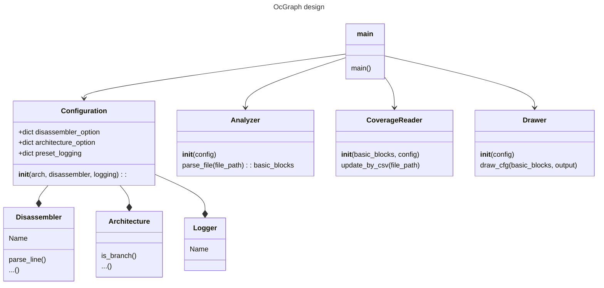

# Development

## Design

```mermaid
---
title: OcGraph design
---
classDiagram

    class Configuration {
        __init__(arch, disassembler, logging):
        +dict disassembler_option
        +dict architecture_option
        +dict preset_logging
    }
    class Disassembler {
        Name
        parse_line()
        ...()
    }
    class Architecture {
        is_branch()
        ...()
    }
    class Logger { Name }

    Configuration --* Disassembler
    Configuration --* Architecture
    Configuration --* Logger

    class Analyzer {
        __init__(config)
        parse_file(file_path): basic_blocks
    }
    class CoverageReader {
        __init__(basic_blocks, config)
        update_by_csv(file_path)
    }
    class Drawer {
        __init__(config)
        draw_cfg(basic_blocks, output)
    }
    class __main__ {
        main()
    }

    __main__ --> Configuration  
    __main__ --> Analyzer  
    __main__ --> CoverageReader  
    __main__ --> Drawer

```
